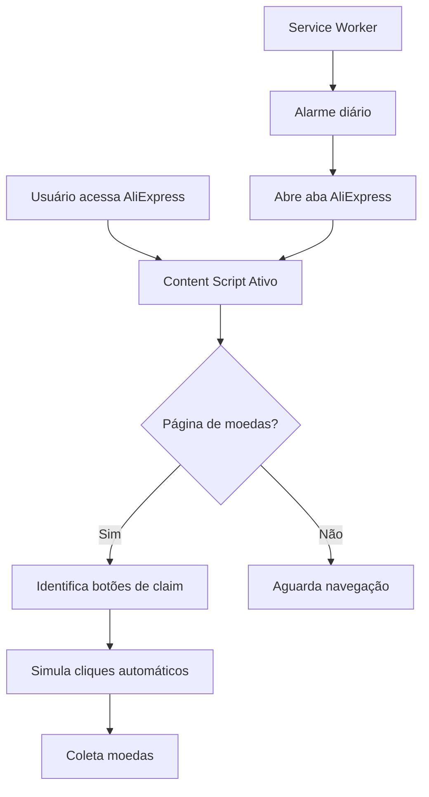

# 🪙 AliExpress Coin Automation

Este repositório contém duas soluções para automatizar a coleta de moedas no AliExpress:
1. **Extensão de Navegador** (Chrome/Edge)
2. **GitHub Actions** (Automação na nuvem)

## 📋 Índice

- [Visão Geral](#visão-geral)
- [Extensão de Navegador](#extensão-de-navegador)
- [Automação com GitHub Actions](#automação-com-github-actions)
- [Comparação das Soluções](#comparação-das-soluções)
- [Configuração](#configuração)

---

## 🎯 Visão Geral

O AliExpress oferece moedas diárias que podem ser coletadas através de tarefas simples. Este projeto automatiza esse processo de duas formas diferentes.

---

## 🔌 Extensão de Navegador

### 📁 Estrutura da Extensão

A extensão está localizada no diretório `/aliexpress` e segue o padrão Manifest V3 do Chrome:

```
aliexpress/
├── manifest.json          # Configuração principal da extensão
├── config.json           # Configuração da interface
├── background.bundle.js  # Service Worker (background)
├── contentScript.bundle.js # Script injetado nas páginas
├── popup.html/js/css     # Interface popup
├── sandbox.html/js       # Ambiente sandbox seguro
└── assets/               # Ícones e fontes
```

### 🔍 Lógica da Extensão

#### 1. **Manifest.json** (Configuração)
```json
{
  "manifest_version": 3,
  "name": "Ali Coin Saver",
  "description": "Automatically Collect Aliexpress coins Everyday",
  "permissions": [
    "tabs", "storage", "cookies", "scripting", 
    "webNavigation", "notifications", "alarms"
  ]
}
```

**Principais componentes:**

- **Service Worker (background.bundle.js)**: Executa em segundo plano, gerencia:
  - Alarmes/agendamentos para coletar moedas automaticamente
  - Comunicação entre diferentes partes da extensão
  - Armazenamento de dados de configuração

- **Content Script (contentScript.bundle.js)**: Injeta código nas páginas do AliExpress:
  - Identifica botões de "Claim/Resgatar" moedas
  - Automatiza cliques nos botões
  - Monitora tarefas diárias disponíveis

- **Popup**: Interface do usuário para:
  - Visualizar status das moedas
  - Configurar ações automáticas
  - Executar coleta manual

#### 2. **Fluxo de Funcionamento**



#### 3. **Permissões Necessárias**

- **tabs**: Gerenciar abas do navegador
- **scripting**: Injetar scripts nas páginas
- **storage**: Salvar configurações
- **cookies**: Manter sessão logada
- **alarms**: Agendar tarefas automáticas
- **webNavigation**: Detectar mudanças de página

### ✅ Vantagens da Extensão

- ✓ Executa no navegador local do usuário
- ✓ Mantém sessão de login ativa
- ✓ Não requer credenciais em texto plano
- ✓ Interface visual amigável
- ✓ Execução rápida e responsiva

### ❌ Desvantagens da Extensão

- ✗ Requer navegador aberto
- ✗ Usuário precisa instalar manualmente
- ✗ Funciona apenas em um dispositivo
- ✗ Pode quebrar com atualizações do site

---

## ⚙️ Automação com GitHub Actions

### 📁 Scripts Puppeteer

O projeto inclui 3 scripts de automação usando Puppeteer:

#### 1. **script-basico.js** - Versão Simples
```javascript
// Acessa AliExpress
// Navega para página de moedas
// Procura botões de claim/resgatar
// Clica automaticamente
```

#### 2. **login-focado.js** - Com Login
```javascript
// Faz login com credenciais
// Acessa página de moedas
// Coleta moedas disponíveis
```

#### 3. **automate-coins.js** - Versão Completa
```javascript
// Login com modo stealth
// Múltiplas tentativas de URLs
// Algoritmo robusto de detecção de botões
// Screenshots de debug
```

### 🔄 Workflow GitHub Actions

Arquivo: `.github/workflows/aliexpress-coins.yml`

```yaml
name: Resgatar Moedas AliExpress

on:
  schedule:
    - cron: '0 10 * * *'  # Executa todo dia às 10h UTC
  workflow_dispatch:        # Permite execução manual

jobs:
  automacao:
    runs-on: ubuntu-latest
    steps:
      - uses: actions/checkout@v4
      - uses: actions/setup-node@v4
      - run: npm install puppeteer
      - run: node scripts/script-basico.js
      - uses: actions/upload-artifact@v4  # Salva screenshots
```

### 🎯 Lógica dos Scripts

#### Fluxo de Execução:

1. **Navegação Inicial**
   - Abre navegador headless (sem interface)
   - Acessa https://www.aliexpress.com

2. **Autenticação** (scripts com login)
   ```javascript
   await page.goto('https://login.aliexpress.com/');
   await page.type('#fm-login-id', process.env.ALIEXPRESS_EMAIL);
   await page.type('#fm-login-password', process.env.ALIEXPRESS_PASSWORD);
   await page.click('button[type="submit"]');
   ```

3. **Acesso à Página de Moedas**
   - Tenta múltiplas URLs alternativas:
     - `https://www.aliexpress.com/coin/task`
     - `https://activities.aliexpress.com/coin/task.php`
     - URLs regionalizadas

4. **Coleta de Moedas**
   ```javascript
   // Busca botões com múltiplos seletores
   const coinSelectors = [
     '.coin-task-claim',
     '.task-claim-btn',
     'button[class*="claim"]',
     // ... mais seletores
   ];
   
   // Clica em todos os botões válidos
   for (const selector of coinSelectors) {
     const buttons = await page.$$(selector);
     for (const button of buttons) {
       if (isVisibleAndEnabled(button)) {
         await button.click();
         await delay(3000);
       }
     }
   }
   ```

5. **Registro de Resultados**
   - Gera screenshots em cada etapa
   - Logs detalhados no console
   - Upload de artefatos no GitHub

### ✅ Vantagens do GitHub Actions

- ✓ **Totalmente automatizado** - Executa sem intervenção
- ✓ **Agendamento preciso** - Cron jobs configuráveis
- ✓ **Sem hardware local** - Executa na nuvem
- ✓ **Gratuito** - 2000 minutos/mês no GitHub
- ✓ **Histórico completo** - Logs e screenshots salvos
- ✓ **Multi-conta** - Pode gerenciar várias contas

### ❌ Desvantagens do GitHub Actions

- ✗ **Requer credenciais** - Email/senha em secrets
- ✗ **Menos confiável** - Sites podem detectar bots
- ✗ **Latência** - Execução pode ser lenta
- ✗ **Limite de execução** - 6 horas máximo por job
- ✗ **Quebra com mudanças** - Seletores podem mudar

---

## 🔀 Comparação das Soluções

| Característica | Extensão de Navegador | GitHub Actions |
|---------------|----------------------|----------------|
| **Instalação** | Manual no navegador | Configurar secrets |
| **Execução** | Local (navegador) | Nuvem (GitHub) |
| **Agendamento** | Alarmes da extensão | Cron schedule |
| **Credenciais** | Sessão do navegador | Secrets do GitHub |
| **Manutenção** | Baixa | Média (updates) |
| **Confiabilidade** | Alta | Média |
| **Custo** | Grátis | Grátis (com limites) |
| **Privacidade** | Alta (local) | Média (secrets) |

---

## 🚀 Configuração

### Opção 1: Extensão de Navegador

1. **Instalar a extensão:**
   ```bash
   # No Chrome/Edge
   chrome://extensions/
   # Ativar "Modo desenvolvedor"
   # Carregar sem compactação -> Selecionar pasta /aliexpress
   ```

2. **Configurar:**
   - Fazer login no AliExpress normalmente
   - A extensão detectará automaticamente
   - Configurar alarmes/notificações no popup

### Opção 2: GitHub Actions

1. **Configurar Secrets** (para scripts com login):
   ```
   Settings → Secrets → New repository secret
   
   ALIEXPRESS_EMAIL = seu@email.com
   ALIEXPRESS_PASSWORD = sua_senha
   ```

2. **Ativar Workflow:**
   ```bash
   # O workflow executa automaticamente às 10h UTC
   # Ou manualmente em: Actions → Resgatar Moedas → Run workflow
   ```

3. **Verificar Resultados:**
   - Actions → Workflow executado
   - Baixar artifacts (screenshots)
   - Verificar logs de execução

### Melhorias Sugeridas para GitHub Actions

1. **Múltiplas contas:**
   ```yaml
   strategy:
     matrix:
       account: [conta1, conta2, conta3]
   ```

2. **Notificações:**
   - Telegram/Discord ao completar
   - Alertas de falha

3. **Retry automático:**
   ```yaml
   - uses: nick-invision/retry@v2
     with:
       max_attempts: 3
   ```

4. **Horários otimizados:**
   ```yaml
   - cron: '0 2,10,18 * * *'  # 3x ao dia
   ```

---

## 📊 Análise Técnica

### Detecção de Botões (Lógica Principal)

Ambas soluções usam estratégias similares:

```javascript
// 1. Múltiplos seletores CSS
const selectors = [
  '.coin-task-claim',      // Classe específica
  'button[class*="claim"]', // Contém "claim"
  '[data-role="claim"]',    // Atributo data
];

// 2. Validação de visibilidade
const isVisible = element => {
  return element.offsetWidth > 0 && 
         element.offsetHeight > 0 && 
         !element.disabled;
};

// 3. Análise de texto
const buttonText = element.textContent.toLowerCase();
const isCoinButton = 
  buttonText.includes('claim') ||
  buttonText.includes('resgatar') ||
  buttonText.includes('collect') ||
  /^\d+$/.test(buttonText);  // Apenas números

// 4. Execução do clique
if (isVisible && isCoinButton) {
  element.click();
  await delay(2000);
}
```

### Principais Desafios

1. **Anti-bot do AliExpress**
   - Solução: Puppeteer Stealth Plugin
   - Headers customizados
   - User-agent realista

2. **Seletores dinâmicos**
   - Solução: Múltiplos seletores alternativos
   - Busca por texto também
   - Fallback para busca genérica

3. **Autenticação**
   - Extensão: Usa cookies do navegador
   - GitHub: Credenciais via secrets

---

## 🎓 Conclusão

**Use a Extensão de Navegador se:**
- ✓ Quer simplicidade
- ✓ Não se importa em deixar navegador aberto
- ✓ Prefere não compartilhar credenciais

**Use GitHub Actions se:**
- ✓ Quer automação 100% hands-off
- ✓ Gerencia múltiplas contas
- ✓ Quer histórico completo de execuções
- ✓ Não se importa em armazenar credenciais

**Solução Ideal:** Use ambos!
- GitHub Actions para execução diária automática
- Extensão para coletas manuais extras

---

## 📝 Licença

Este projeto é apenas para fins educacionais. Use por sua conta e risco.

## 🤝 Contribuindo

Pull requests são bem-vindos! Para mudanças importantes, abra uma issue primeiro.
